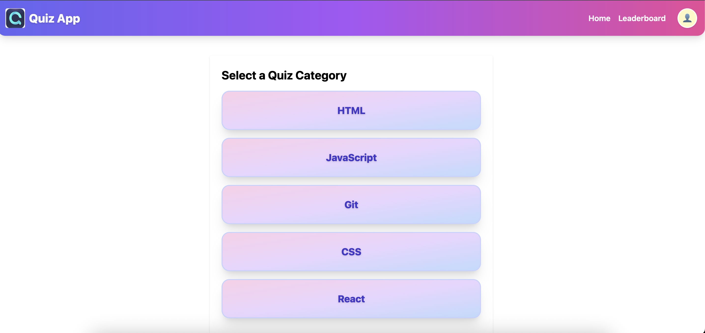
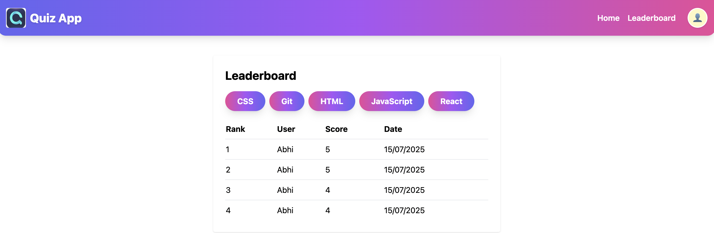
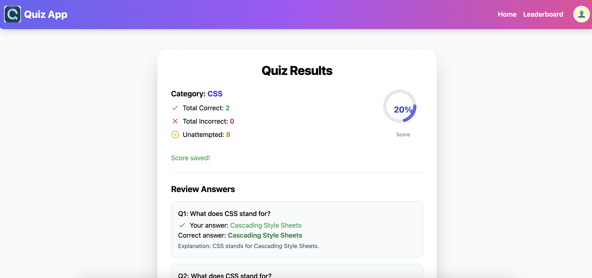

# 🎯 Quiz App

A modern full-stack quiz application featuring an engaging and colorful user interface. Test your knowledge across various categories while competing with others!

## 🚀 Tech Stack

### Frontend
- React with TypeScript
- Tailwind CSS for styling
- Vite for build tooling
- React Router for navigation

### Backend
- Node.js & Express
- MongoDB for database
- JWT for authentication

---

##  [Live Demo](https://aartimulti-assigment.onrender.com/)

---

## ✨ Key Features

- 🔐 Secure user authentication (login/register)
- 📚 Multiple quiz categories to choose from
- ⚡ Instant feedback and scoring
- 📊 Real-time results and detailed answer review
- 🏆 Global leaderboard to track rankings
- 📱 Fully responsive design for all devices
- 🎨 Modern and intuitive user interface

---

## Screenshots

### Home Page


### Leaderboard


### Result Page


---

## Getting Started

### 1. Clone the Repository

```bash
git clone https://github.com/abhiroy829429/AartiMulti_Assigment.git
cd aartimulti_services_assignment
```

---

### 2. Setup the Backend

1. Go to the backend folder:
   ```bash
   cd backend
   ```
2. Install dependencies:
   ```bash
   npm install
   ```
3. Set up your MongoDB connection in `.env` (or use the default in `index.js`).
4. (Optional) Seed the database with sample questions:
   ```bash
   node data/seed.js
   ```
5. Start the backend server:
   ```bash
   npm start
   ```
   The backend runs on [http://localhost:5001](http://localhost:5001).

---

### 3. Setup the Frontend

1. Open a new terminal and go to the frontend folder:
   ```bash
   cd frontend
   ```
2. Install dependencies:
   ```bash
   npm install
   ```
3. Start the frontend dev server:
   ```bash
   npm run dev
   ```
   The frontend runs on [http://localhost:5173](http://localhost:5173).

---

## Usage

- Register or log in.
- Choose a quiz category and answer questions.
- See your results, review answers, and check the leaderboard.

---

## Project Structure

```
backend/    # Express API, MongoDB models, routes
frontend/   # React app, UI components, services
```

---

## 📝 Notes

- Make sure MongoDB is running and accessible.
- The API base URL is set to `http://localhost:5001/api` in the frontend services.
- For any issues, check your terminal for error messages.

## 🤝 Contributing

Contributions are welcome! Please feel free to submit a Pull Request.

1. Fork the repository
2. Create your feature branch (`git checkout -b feature/AmazingFeature`)
3. Commit your changes (`git commit -m 'Add some AmazingFeature'`)
4. Push to the branch (`git push origin feature/AmazingFeature`)
5. Open a Pull Request

## 📄 License

This project is licensed under the MIT License - see the LICENSE file for details.

## 👏 Acknowledgments

- Thanks to all contributors who helped in building this application
- Special thanks to the open-source community for the amazing tools and libraries

---
